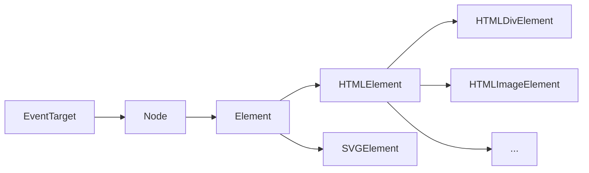

# 组件

[TOC]

## 组件 - 扩展内容

> 对具有一定独立功能的数据与方法的封装，对外暴露接口，有利于代码功能的复用，且不用担心冲突问题。

在开发中尽可能的复用代码是我们的 <u>毕生追求</u>，但是在以前代码的复用并没有想象那么好，通常我们复用的内容不仅仅只是 <u>JavaScript</u>，还有 <u>HTML</u>，<u>CSS</u>，它们可能结构复杂，样式繁多，而且还是分离的（分久必合，合久必分），使用起来特别的不方便，好在现在有个叫做 <u>WebComponent</u> 的，出现了！

### WebComponent

简单一点说，有了 <u>WebComponent</u>，我们就拥有了 <u>扩展</u> 和 <u>定制</u> 自定义元素的功能。

**使用类继承**

页面中的每一个元素都对应着一个类，每一个元素都是某个对应类的实例，同时这些类也存在着一定的关系



在 <u>WebComponent</u> 中，自定义元素一共分为两种

- Autonomous custom elements：独立自定义元素
- Customized built-in elements：内置自定义元素

#### Autonomous custom elements

该类自定义元素总是继承自：<u>HTMLElement</u> 类

```javascript
class UserInfoElement extends HTMLElement {
  	constructor() {
      	super();
      	console.log('我是自定义元素');
    }
}
```

**定义自定义元素**

创建了元素类以后，还不能直接在页面中使用，需要使用 <u>customElements.define</u> 方法进行注册

> customElements.define(name, constructor, options);

```js
customElements.define('user-info', UserInfoElement);
```

页面中使用

```html
<user-info></user-info>
```

**Shadow DOM**

Web components的一个重要特性是封装——可以将html标签结构、css样式和行为隐藏起来，并从页面上的其他代码中分离开来，这样不同的功能不会混在一起，代码看起来也会更加干净整洁。其中，Shadow DOM接口是关键所在，它可以将一个隐藏的、独立的DOM添加到一个元素上


- <u>Shadow DOM</u> 是节点背后的内容
- 子元素是节点包含的内容

**创建影子节点**

每个元素的 <u>Shadow DOM</u> 都有一个根节点，我们可以通过 <u>attachShadow</u> 方法来创建

```js
this.attachShadow({mode: 'open'});
```

- open：外部可以通过节点的 <u>shadowRoot</u> 属性来访问节点内部的内容
- closed：外部不可以方法节点内部的内容

**内部独立作用域**

<u>Shadow DOM</u> 中的内部元素和样式是不会影响到它的外部元素的

```js
class UserInfo extends HTMLElement {
    constructor() {
        super();

        let shadow = this.attachShadow({mode: 'open'});

        let style = document.createElement('style');
        style.textContent = `span {color:red}`;

        let span = document.createElement('span');
        span.innerHTML = '我是自定义元素的内容';
        span.classList.add('cred');

        shadow.appendChild(style);
        shadow.appendChild(span);
    }
}
```

**使用 attribute 获取外部传入数据**

类似于函数，组件内部也是可以接收传入的数据，通过 <u>元素属性</u> 传入，内部通过 <u>attribute</u> 来操作

```js
class UserInfo extends HTMLElement {
    constructor() {
        super();

        let shadow = this.attachShadow({mode: 'open'});

        let style = document.createElement('style');
        style.textContent = `span {color:red}`;

        let span = document.createElement('span');
        span.innerHTML = this.getAttribute('content');
        span.classList.add('cred');

        shadow.appendChild(style);
        shadow.appendChild(span);
    }
}
```

#### Customized built-in elements

 内置自定义元素与独立自定义元素不同点在于，它继承不在是 <u>HTMLElement</u>，而是具体的元素类，如：<u>HTMLDivHTML</u>、<u>HTMLImageHTML</u>

```js
class LazyLoadImage extends HTMLImageElement {
    constructor() {
        super();
        let _src = this.getAttribute('src');
        this.setAttribute('src', '');
        setTimeout(_ => {
            this.setAttribute('src', _src);
        }, 2000);
    }
}
customElements.define('lazy-load', LazyLoadImage, {extends: 'img'})
```

使用过程中需要注意：<u>is</u> 属性，允许某个元素通过 <u>is</u> 指定的自定义元素进行处理

```html

```


关于原生组件的概念，我们在后面的课程中会通过对比的方式来进行讲解！！！


## 思考 & 问题

- 什么是 <u>super</u> ？